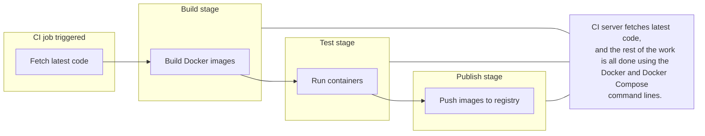

source: [[Docker in a Month of Lunches]]

# Building and testing applications with Docker and Docker Compose
[[Continuous Integration|CI]] with Docker is the focus of this chapter.  Normally, setting up CI was time intensive and sometimes required a full-time person.  Docker and [[Docker Compose]] can simplify this.

## 11.1 - How the CI process works with Docker

CI processes start with code, execute a series of steps and ends with a tested deployable artifact.  However, what happens on the CI server, pipelines become unique for each project.  Often requiring different toolchains to be installed on the CI server.  Docker provides consistency.  Every process now follows the same steps, code changes, build Docker images, push to a registry.



Everything runs inside container so the CI server needs no special knowledge of how to build any of the projects.  Tests are run during the image build, so if they fail, everything stops.  Integration tests could be launched with Docker Compose.

In this process, everything happens inside containers, but some infrastructure is still needed:
- a centralized source code system
- a Docker registry to store images
- and an automation server to run the CI jobs

There are many tools to fit this need, [Azure DevOps](https://azure.microsoft.com/en-us/services/devops/) and DockerHub, [GitLab](https://about.gitlab.com/) (all-in-one solution), or build your own with containers.

## 11.2 - Spinning up build infrastructure with Docker

Normally running your own infrastructure when services are available for free isn't ideal.  However, use cases like needing to keep your data private, or having a backup when these services have failures can be helpful.  Plus, you get intimate knowledge of how it all works.

We'll be using these components
- Source Control - https://gogs.io/
- Distribution - Docker Registry
- Automation - https://www.jenkins.io/

For this you definitely need the [GitHub repo](https://github.com/sixeyed/diamol) on your machine. 

```powershell
cd \ch11\exercises\infrastructure

# start the app with Linux containers:
docker-compose -f docker-compose.yml -f docker-compose-linux.yml up -d

# OR start with Windows containers:
docker-compose -f docker-compose.yml -f docker-compose-windows.yml up -d

# add registry domain to local hosts file on Mac or Linux:
echo $'\n127.0.0.1 registry.local' | sudo tee -a /etc/hosts

# OR on Windows:
Add-Content -Value "127.0.0.1 registry.local" -Path /windows/system32/drivers/etc/hosts

# check containers:
docker container ls
```

- Gogs - [http://localhost:3000/](http://localhost:3000/)
- Jenkins - [http://localhost:8080/](http://localhost:8080/)
- Docker registry- [http://localhost:5000/](http://localhost:5000/)

For Gogs you have to run through the install, accept all the defaults and use `diamol` for the username, email and password don't matter.  Create a new repository called `diamol`.

Jenkins is all setup, the user and password are both `diamol`.

Push the repo to Gogs
```powershell
git remote add local http://localhost:3000/diamol/diamol.git
 
git push local
 
# Gogs will ask you to login -
# use the diamol username and password you registered in Gogs
```

Jenkins looks for changes every minute, but since the build failed, it put the schedule on hold.  Manually run the job.  In a a couple of minutes the second job will complete.  Each stage, verify, build, test, and push is really just executing Docker commnds.

> Every part of this pipeline ran using Docker containers, taking advantage of a neat trick: containers running in Docker can connect to the Docker API and start new containers on the same Docker Engine they're running on. The Jenkins image has the Docker CLI installed, and the configuration in the Compose file sets up Jenkins so when it runs Docker commands they get sent to the Docker Engine on your machine. It sounds odd, but it's really just taking advantage of the fact that the Docker CLI calls into the Docker API, so CLIs from different places can connect to the same Docker Engine.

> The Docker CLI connects to the local Docker API by default, using a communication channel that is private to your machine--a socket on Linux or a named pipe on Windows. That communication channel can be used as a bind mount for containers, so when the CLI in the container runs, it's actually connecting to the socket or named pipe on your machine. That unlocks some useful scenarios where apps inside containers can query Docker to find other containers, or start and stop new containers. There is also a security concern here, because the app in the container has full access to all the Docker features on the host, so you need to use this carefully with Docker images that you trust--you can trust my diamol images, of course.
> 
```yaml
# docker-compose.yml
services
  jenkins:
    image: diamol/jenkins
    ports:
      - "8080:8080"
    networks:
      - infrastructure

# docker-compose-linux.yml
services:
 jenkins:
   volumes:
     - type: bind
       source: /var/run/docker.sock
       target: /var/run/docker.sock

# docker-compose-windows.yml
services:
  jenkins:
    volumes:
      - type: npipe
        source: \\.\pipe\docker_engine
        target: \\.\pipe\docker_engine
```

## 11.3 - Capturing build settings with Docker Compose

Using the approach from [[10 Running multiple environments with Docker Compose]] multiple Compose files have been used to define the application.

```yaml
version: "3.7"

services:
  numbers-api:
    image: ${REGISTRY:-docker.io}/diamol/ch11-numbers-api:v3-build-${BUILD_NUMBER:-local}
    networks:
      - app-net

  numbers-web:
    image: ${REGISTRY:-docker.io}/diamol/ch11-numbers-web:v3-build-${BUILD_NUMBER:-local}
    environment:
      - RngApi__Url=http://numbers-api/rng
    depends_on:
     - numbers-api
    networks:
      - app-net
```

The `image` tags use [[environment variables]] to set read in values and default them if they are not present.  `${REGISTRY:-docker.io}` says, use the value that's in the `REGISTRY` environment variable, but if it's not there, default it to `docker.io`.  The same with `${BUILD_NUMBER:-local}`.  If `BUILD_NUMBER` doesn't exist, `local` will be used instead.

> This is a very useful pattern for supporting a CI process and a local developer build using the same set of artifacts. When a developer builds the API image, they won't have any environment variables set, so the image will be called `docker.io/diamol/ ch11-numbers-api:v3-build-local`.  But `docker.io` is Docker Hub, which is the default domain, so the image will just be shown as `diamol/ch11-numbers-api:v3-build-local`.  When the same build runs in Jenkins, the variables will be set to use the local Docker registry and the actual build number for the job, which Jenkins sets as an incrementing number, so the image name will be `registry.local:5000/diamol/ch11-numbers-api:v3-build-2`.

### Labels
> Docker lets you apply labels to most resources--containers, images, networks, and volumes. They're simple key/value pairs where you can store additional data about the resource. Labels are very useful on images because they get baked into the image and move with it--when you push or pull the image, the labels go along too. When you build your app with a CI pipeline, it's important to have an audit trail that lets you track back from the running container to the build job that created it, and image labels help you do that.

Specifying image labels and build arguments in the Dockerfile
```yaml
# app image
FROM diamol/dotnet-aspnet

ARG BUILD_NUMBER=0
ARG BUILD_TAG=local

LABEL version="3.0"
LABEL build_number=${BUILD_NUMBER}
LABEL build_tag=${BUILD_TAG}

ENTRYPOINT ["dotnet", "Numbers.Api.dll"]
```

The `LABEL` instruction just applies the key/value pair from the Dockerfile to the image.  `LABEL version="3.0"` is hardcoded while the other two come from environment variables, provided by the `ARG` instruction.

`ARG` is similar to `ENV` except that it works at *build* time, rather than runtime in the container.  Both set an environment variable, but `ARG` variables are only exist for the duration of the build.  Container run from the image don't see that variable.  It's a great way to pass data into the build process that isn't needed for running containers.

Specifying build settings and reusable arguments in Docker Compose
```yaml
version: "3.7"

x-args: &args
  args:
    BUILD_NUMBER: ${BUILD_NUMBER:-0}
    BUILD_TAG: ${BUILD_TAG:-local}

services:
  numbers-api:
    build:
      context: numbers
      dockerfile: numbers-api/Dockerfile.v4
      <<: *args

  numbers-web:
    build:
      context: numbers
      dockerfile: numbers-web/Dockerfile.v4
      <<: *args
```

- `context` --This is the path Docker will use as the working directory for the build. This is usually the current directory, which you pass with a period in the `docker image build` command, but here it's the `numbers` directory--the path is relative to the location of the Compose file.
- `dockerfile` --The path to the Dockerfile, *relative to the context*.
- `args` --Any build arguments to pass, which need to match the keys specified as `ARG` instructions in the Dockerfile. Both the Dockerfiles for this app use the same `BUILD_NUMBER` and `BUILD_TAG` arguments, so I'm using a Compose extension field to define those values once, and YAML merge to apply it to both services.

> You should always aim for a single Dockerfile that gets built in the same way however the build is run. Default arguments in the Compose file mean the build succeeds when you run it outside of the CI environment, and defaults in the Dockerfile mean the image builds correctly even if you don't use Compose.

```powershell
# change to the numbers directory

# (this is done with the context setting in Compose):
cd ch11/exercises/numbers

# build the image, specifying the Dockerfile path and a build argument:
docker image build -f numbers-api/Dockerfile.v4 --build-arg BUILD_TAG=ch11 -t numbers-api .

# check the labels:
docker image inspect -f '{{.Config.Labels}}' numbers-api
```

## 11.4 - Writing CI jobs with no dependencies except Docker

A major benefit to running containerized CI is the ability to build code without needing the SDKs installed locally.  Once everything can be run with a combination of `docker` and `docker compose` commands, any CI system can use these commands and they become instantly portable.

In this example, the Jenkfiles file stages merely execute various `bat` files.  Those `bat` files are `docker` and `docker compose` commands.  Moving this to GitHub Actions or Azure DevOps would be as easy as creating each YAML file to call the `bat` files and they would run exactly the same.

## 11.5 - Understanding containers in the CI process

Docker adds a layer of consistency on top of all your application builds, and you can use that consistency to add many useful features to your pipeline. For example, extending the CI process to include security-scanning container images for known vulnerabilities and digitally signing images to assert their provenance.

Docker calls this approach the secure software supply chain, and it's important for all sizes of organizations because it gives you confidence that the software you're about to deploy is safe. You can run tooling in your pipeline to check for known security vulnerabilities and fail the build if there are issues. You can configure your production environment to only run containers from images that have been digitally signed--a process that happens at the end of a successful build. When your containers are deployed to production, you can be certain that they're running from images that came through your build process, and that they contain software that has passed all your tests and is free from security issues.
